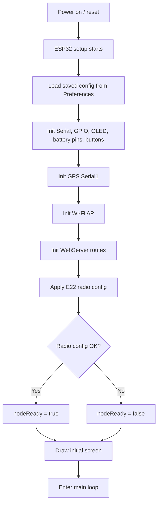
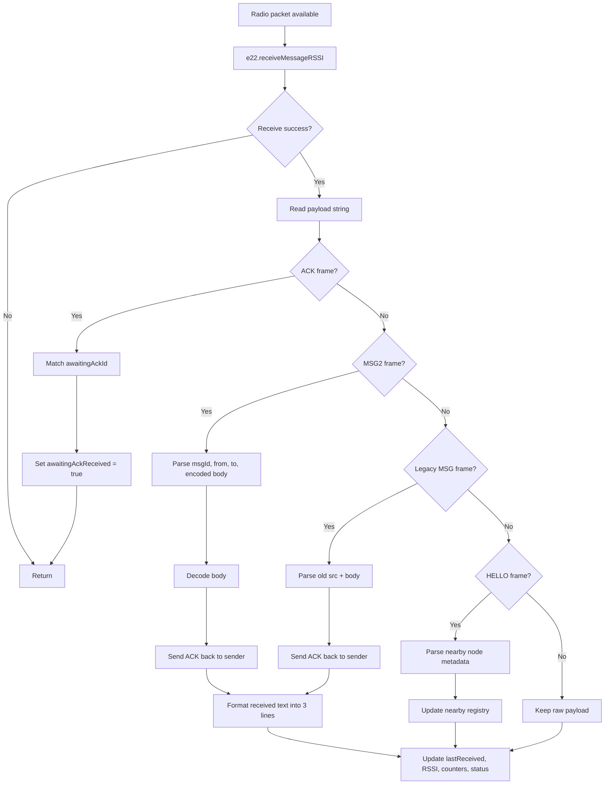
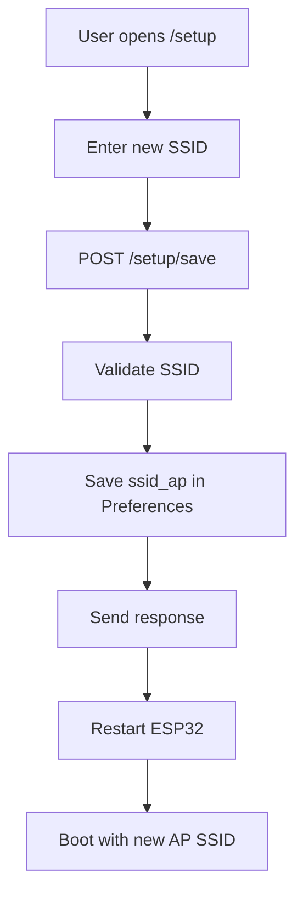

# LoRa Node (ESP32 + E22-900T33S)

This project is an ESP32 firmware (`Node.ino`) for a LoRa node built with an E22-900T33S transceiver.  
It combines:

- LoRa messaging (direct or via repeater)
- Local Wi-Fi Access Point control panel
- Dynamic runtime configuration saved to flash
- OLED status screens
- GPS reading
- Battery and charging monitoring

## What the code does

The firmware starts the ESP32 as a Wi-Fi AP and hosts a web UI to control node behavior without reflashing:

- Configure LoRa address, network ID, channel, repeater address, and CRYPT key
- Send messages to default target or to discovered nearby nodes
- View runtime status, message stats, and radio diagnostics
- Change AP SSID and persist it in `Preferences`
- Restart automatically after config updates

It also keeps a nearby-node registry by processing periodic `HELLO` beacons and marks nodes online/offline using a TTL window.

## Main components

- `LoRa_E22` for E22 module communication and configuration
- `WebServer` for local configuration and monitoring pages
- `Preferences` for persistent config storage (`lora-config`)
- `Adafruit_SSD1306` OLED UI with multi-screen display and popup states
- `TinyGPSPlus` + `Serial1` for GPS parsing
- Battery ADC + charging pin logic for status display

## Full process flow

This section shows the full firmware behavior from power-on to runtime messaging, node discovery, and UI/API refresh.

### 1. System startup flow



### 2. Main runtime loop

```mermaid
flowchart TD
    A[loop()] --> B[server.handleClient]
    B --> C[Read GPS bytes from Serial1]
    C --> D{nodeReady?}
    D -->|Yes| E[checkIncoming]
    D -->|No| F[Skip radio RX]
    E --> G{Beacon interval reached?}
    F --> G
    G -->|Yes| H[sendHelloBeacon]
    G -->|No| I[Skip beacon]
    H --> J[Handle buttons]
    I --> J
    J --> K[Update popup timeout]
    K --> L[Read battery on interval]
    L --> M[Refresh OLED on interval]
    M --> N[Repeat loop]
```

### 3. Nearby node discovery and online sync

```mermaid
flowchart TD
    A[Node ready] --> B[Periodic HELLO beacon]
    B --> C["HELLO|addr|netId|channel|role|callSign|lat|lng"]
    C --> D[Other node receives HELLO]
    D --> E[Validate netId and channel]
    E -->|Valid| F[Upsert nearby node registry]
    E -->|Invalid| G[Ignore packet]
    F --> H[Update lastSeen, RSSI, role, GPS, callSign]
    H --> I[countOnlineNearbyNodes using TTL window]
    I --> J[onlineNodes for OLED]
    I --> K[/api/nodes online field]
```

### 4. Web UI and API process

```mermaid
flowchart TD
    A[Phone / browser connects to AP] --> B[Open /]
    B --> C[Control panel HTML + JS loads]
    C --> D[JS polls APIs every 2 seconds]
    D --> E[/api/status]
    D --> F[/api/log]
    D --> G[/api/nodes]
    E --> H[Update uptime, stats, addresses, battery, radio data]
    F --> I[Update message log table]
    G --> J[Update nearby node selector and online state]
    C --> K[User action]
    K --> L[/send]
    K --> M[/config]
    K --> N[/setup/save]
    L --> O[Send LoRa message]
    M --> P[Save config and restart]
    N --> Q[Save AP SSID and restart]
```

## Default behavior

- Default node address low byte: `0x02`
- Default network ID: `0x01`
- Default channel: `0x41` (915 MHz region mapping in current setup)
- Default CRYPT key: `0x8002`
- AP SSID format: `LM-<MY_ADDL>` (for example `LM-2`)
- AP password: `12345678`

## Web routes

### UI pages

- `/` - Main control panel (send message, configure node, logs)
- `/setup` - Wi-Fi AP SSID setup page
- `/status` - Device + E22 diagnostic status page

### Actions

- `/send?msg=...` - Send direct message
- `/send?msg=...&relay=1` - Send via repeater mode
- `/send?msg=...&to=AABB` - Send to specific 16-bit hex address
- `/config?...` - Save new node config and restart
- `POST /setup/save` - Save AP SSID and restart

### JSON APIs

- `/api/status` - Node, traffic, battery, and E22 config info
- `/api/log` - Message log entries
- `/api/nodes` - Nearby node list with RSSI and online status

## Message flow process

This firmware now treats one chat message as 3 logical fields:

```text
from_contact_id
to_contact_id
message
```

In the current firmware:

- `from_contact_id` = sender LoRa node address, for example `0003`
- `to_contact_id` = destination LoRa node address, for example `0008`
- `message` = plain message body entered by user

### 1. Send request from Web UI

The control panel sends a request like:

- `/send?msg=Hello`
- `/send?msg=Hello&to=0008`
- `/send?msg=Hello&relay=1&to=0008`

The firmware uses:

- the configured target address, or
- the `to` address override from the request

### 2. Firmware builds structured radio payload

Before transmitting, the firmware converts the message into a structured LoRa frame:

```text
MSG2|<msgId>|<from_contact_id>|<to_contact_id>|<url_encoded_message>
```

Example:

```text
MSG2|0001|0003|0008|Hello%20world
```

Notes:

- `msgId` is used for ACK tracking
- message text is URL-encoded so spaces, newlines, and special characters are safe on the radio link
- if repeater mode is enabled, the payload is wrapped in a relay envelope before transmission

### 3. Direct or repeater transmission

The firmware sends the payload in one of two ways:

1. Direct to destination node address
2. To repeater node, which forwards the message toward final destination

For repeater mode, the app-level message stays the same. Only the transport envelope changes.

### 4. Receiver parses message

When another node receives a packet:

- if the packet is `ACK|<msgId>`, it completes the sender ACK flow
- if the packet is `MSG2|...`, the node extracts:
  - `from_contact_id`
  - `to_contact_id`
  - decoded `message`
- the node then converts it into display/log format:

```text
from_contact_id
to_contact_id
message
```

Example received content:

```text
0003
0008
Hello world
```

This formatted value is what appears in:

- `lastSent`
- `lastReceived`
- message log entries

### 5. ACK response

After receiving a valid message packet, the destination node sends:

```text
ACK|<msgId>
```

The sender waits for ACK for a short timeout window and marks the result as:

- `SENT ACK`
- `SENT NO ACK`

### 6. Backward compatibility

The firmware can still read older packets in the old format:

```text
MSG|<msgId>|<srcAddrHex>|<body>
```

When an old packet is received, it is normalized internally to the same 3-line display format:

```text
from_contact_id
to_contact_id
message
```

### 7. Flow diagram

```mermaid
flowchart TD
    A[User enters message in Web UI] --> B[/send?msg=...]
    B --> C[Node firmware reads msg and destination]
    C --> D[Build structured payload]
    D --> E["MSG2|msgId|from_contact_id|to_contact_id|url_encoded_message"]

    E --> F{Send mode}
    F -->|Direct| G[Send to destination node]
    F -->|Relay| H[Wrap in RELAY envelope]
    H --> I[Send to repeater node]
    I --> J[Repeater forwards to destination]
    G --> K[Destination node receives packet]
    J --> K

    K --> L{Packet type valid?}
    L -->|MSG2| M[Parse from_contact_id, to_contact_id, message]
    L -->|Legacy MSG| N[Normalize old format to same 3-line structure]

    M --> O[Format for UI and logs]
    N --> O
    O --> P["from_contact_id\nto_contact_id\nmessage"]
    P --> Q[Update lastReceived and message log]

    K --> R[Send ACK|msgId back to sender]
    R --> S[Sender waits for ACK timeout window]
    S --> T{ACK received?}
    T -->|Yes| U[Status = SENT ACK]
    T -->|No| V[Status = SENT NO ACK]

    U --> W[Update lastSent and log entry]
    V --> W
```

### 7.1 Receive pipeline inside firmware



### 7.2 Send pipeline inside firmware

```mermaid
flowchart TD
    A[/send request or internal send call] --> B[Resolve target address]
    B --> C[Build MSG2 payload]
    C --> D{Relay enabled?}
    D -->|No| E[Send direct to final node]
    D -->|Yes| F[Wrap in RELAY envelope]
    F --> G[Send to repeater address]
    E --> H[Wait for ACK]
    G --> H
    H --> I{ACK before timeout?}
    I -->|Yes| J[Status = SENT ACK]
    I -->|No| K[Retry until ACK_RETRY_MAX]
    K --> L{Any retry left?}
    L -->|Yes| D
    L -->|No| M[Status = SENT NO ACK]
    J --> N[Update lastSent and log]
    M --> N
```

### 7.3 Configuration save and restart flow

```mermaid
flowchart TD
    A[User edits config in Web UI] --> B[/config request]
    B --> C[Parse ADDH, ADDL, target, repeater, netId, channel, crypt]
    C --> D[Save values to Preferences]
    D --> E[Send HTTP success response]
    E --> F[Delay briefly]
    F --> G[ESP.restart]
    G --> H[Boot again]
    H --> I[Load saved config]
    I --> J[Apply config to E22]
```

### 7.4 AP SSID update flow



Short version:

1. User sends a message from the web UI.
2. Firmware converts it to `MSG2`.
3. Packet goes direct or through repeater.
4. Receiver decodes it into `from_contact_id`, `to_contact_id`, and `message`.
5. Receiver sends `ACK|msgId`.
6. Sender updates status and logs.

### 8. Relation to local database

If you store messages in SQLite, map the firmware fields like this:

- `from_contact_id` -> `messages.from_contact_id`
- `to_contact_id` -> `messages.to_contact_id`
- `message` -> `messages.payload`
- `msgId` or app-generated UUID -> `messages.message_uuid`

## Local database design

For local storage (mobile app, desktop app, or gateway service), use SQLite with the following tables.

### 1) Contacts

Store known peers for direct messaging and address book UI.

```sql
CREATE TABLE contacts (
  id INTEGER PRIMARY KEY AUTOINCREMENT,
  lora_address TEXT NOT NULL UNIQUE,     -- Example: "0002"
  display_name TEXT NOT NULL,
  avatar_url TEXT,
  is_blocked INTEGER NOT NULL DEFAULT 0,
  created_at TEXT NOT NULL DEFAULT (datetime('now')),
  updated_at TEXT NOT NULL DEFAULT (datetime('now'))
);
```

### 2) Groups

Store group metadata and ownership.

```sql
CREATE TABLE groups (
  id INTEGER PRIMARY KEY AUTOINCREMENT,
  group_uuid TEXT NOT NULL UNIQUE,       -- Stable app-level group ID
  group_name TEXT NOT NULL,
  owner_contact_id INTEGER NOT NULL,     -- Group owner
  created_at TEXT NOT NULL DEFAULT (datetime('now')),
  updated_at TEXT NOT NULL DEFAULT (datetime('now')),
  FOREIGN KEY (owner_contact_id) REFERENCES contacts(id)
);
```

### 3) Group members

Map contacts to groups, including owner/admin/member roles.

```sql
CREATE TABLE group_members (
  id INTEGER PRIMARY KEY AUTOINCREMENT,
  group_id INTEGER NOT NULL,
  contact_id INTEGER NOT NULL,
  role TEXT NOT NULL DEFAULT 'member',   -- owner | admin | member
  joined_at TEXT NOT NULL DEFAULT (datetime('now')),
  is_active INTEGER NOT NULL DEFAULT 1,
  UNIQUE (group_id, contact_id),
  FOREIGN KEY (group_id) REFERENCES groups(id) ON DELETE CASCADE,
  FOREIGN KEY (contact_id) REFERENCES contacts(id) ON DELETE CASCADE
);
```

### 4) Messages

Store both direct and group messages in one table.

```sql
CREATE TABLE messages (
  id INTEGER PRIMARY KEY AUTOINCREMENT,
  message_uuid TEXT NOT NULL UNIQUE,
  chat_type TEXT NOT NULL,               -- direct | group
  from_contact_id INTEGER NOT NULL,
  to_contact_id INTEGER,                 -- used when chat_type = 'direct'
  group_id INTEGER,                      -- used when chat_type = 'group'
  payload TEXT NOT NULL,                 -- encrypted/plain text payload
  payload_type TEXT NOT NULL DEFAULT 'text',
  delivery_status TEXT NOT NULL DEFAULT 'pending', -- pending/sent/delivered/failed
  sent_at TEXT,
  received_at TEXT,
  created_at TEXT NOT NULL DEFAULT (datetime('now')),
  FOREIGN KEY (from_contact_id) REFERENCES contacts(id),
  FOREIGN KEY (to_contact_id) REFERENCES contacts(id),
  FOREIGN KEY (group_id) REFERENCES groups(id) ON DELETE CASCADE
);
```

### Recommended indexes

```sql
CREATE INDEX idx_contacts_lora_address ON contacts(lora_address);
CREATE INDEX idx_group_members_group_id ON group_members(group_id);
CREATE INDEX idx_group_members_contact_id ON group_members(contact_id);
CREATE INDEX idx_messages_direct_chat ON messages(chat_type, from_contact_id, to_contact_id, created_at);
CREATE INDEX idx_messages_group_chat ON messages(chat_type, group_id, created_at);
CREATE INDEX idx_messages_delivery_status ON messages(delivery_status);
```

### Notes for usage

- A **direct chat** row has `chat_type='direct'` and `to_contact_id` set.
- A **group chat** row has `chat_type='group'` and `group_id` set.
- Keep the group owner in `groups.owner_contact_id`; also add the same owner in `group_members` with `role='owner'`.
- Use `message_uuid` for deduplication when receiving repeated LoRa packets.
- Enable SQLite foreign keys at startup: `PRAGMA foreign_keys = ON;`.

## Hardware mapping (from code)

### E22 module

- TX: GPIO `4`
- RX: GPIO `22`
- AUX: GPIO `18`
- M0: GPIO `21`
- M1: GPIO `19`

### OLED (I2C)

- SDA: GPIO `27`
- SCL: GPIO `33`
- Address: `0x3C`
- Size: `128x64`

### GPS (Serial1)

- TX: GPIO `25`
- RX: GPIO `26`
- Baud: `9600`

### Battery + buttons

- Battery voltage ADC: GPIO `36`
- Charging detect: GPIO `34`
- Next button: GPIO `32`
- Previous button: GPIO `35` (input-only, external pull-up recommended)

## Quick start

1. Open `Node.ino` in Arduino IDE.
2. Install required libraries:
   - `LoRa_E22`
   - `Adafruit GFX Library`
   - `Adafruit SSD1306`
   - `TinyGPSPlus`
3. Select your ESP32 board and upload.
4. Connect to AP (`LM-...`, password `12345678`).
5. Open the AP IP (shown on Serial/OLED, usually `192.168.4.1`) in browser.
6. Configure node parameters and save.

## Notes

- All nodes should share compatible `NETID`, channel, and `CRYPT` settings.
- `CRYPT = 0000` disables encryption in current logic.
- Repeater behavior depends on both app setting (`USE_REPEATER`) and E22 transmission mode configuration applied during setup.
