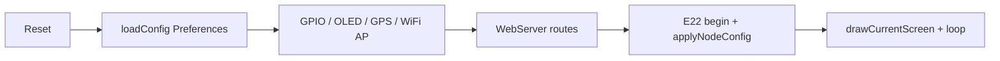
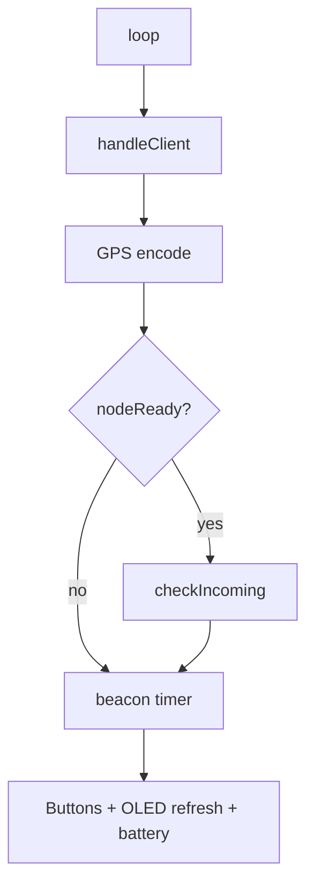

# LoRa Node — ESP32 + E22-900T33S (OLED + joystick)

Firmware sketch: **`Node_Buzzer_Joystrick.ino`**

ESP32 firmware for a LoRa node using an **E22-900T33S** module. It exposes a **Wi‑Fi access point** with a web control panel, drives a **128×64 SSD1306 OLED** (typical **1.54″** module), and supports a **5-way joystick** (or discrete buttons) for local UI.

## Features

- LoRa messaging (direct or via repeater), structured **`MSG2`** payloads, ACK handling, legacy **`MSG`** receive
- Periodic **`HELLO`** beacons and a **nearby-node registry** (RSSI, online TTL, optional GPS/call sign)
- **Web UI** + JSON APIs for config, send, logs, and status
- **OLED** multi-screen UI with header (battery %, time), page dots, popups, charging view
- **Display** settings: OLED sleep timeout and brightness (preview in RAM, **hold Select** to save to flash)
- **GPS** on `Serial1` (**TinyGPSPlus**)
- **Battery** ADC + **charging** detect; buzzer pin defined for alerts

## Requirements (Arduino libraries)

- `LoRa_E22`
- `Adafruit GFX Library`
- `Adafruit SSD1306`
- `TinyGPSPlus`

Board: **ESP32** (Arduino core). Upload the sketch from this folder.

## Default configuration (from source)

Values are overridden after first save in **`Preferences`** namespace `lora-config`.

| Item | Default (sketch) |
|------|------------------|
| Node address | `MY_ADDH/MY_ADDL` = `0x00` / `0x04` → AP SSID like `LM-4` |
| Target | `0x0000` |
| Repeater | `0xFFFF` |
| Network ID | `0x01` |
| Channel | `0x41` (915 MHz setup in current project) |
| CRYPT | `0x8002` |
| AP password | `12345678` |
| OLED sleep | mode `3` = **Never** (modes `0–2`: 10s / 40s / 1m) |
| OLED brightness | `90%` |

## Hardware pins (as in `Node_Buzzer_Joystrick.ino`)

### E22 (UART2)

| Signal | GPIO |
|--------|------|
| TX | 4 |
| RX | 22 |
| AUX | 18 |
| M0 | 21 |
| M1 | 19 |

### OLED (I2C)

| Signal | GPIO |
|--------|------|
| SDA | 27 |
| SCL | 33 |
| I²C address | `0x3C` |
| Resolution | 128 × 64 |

### GPS (`Serial1`)

| Signal | GPIO |
|--------|------|
| GPS module TX → ESP RX | 25 |
| GPS module RX ← ESP TX | 26 |
| Baud | 9600 |

### Battery, buzzer, buttons

| Function | GPIO | Notes |
|----------|------|--------|
| Battery voltage ADC | **35** | Divider/scaling in firmware (`BAT_*` constants) |
| Charging detect (input) | **34** | HIGH when charging |
| Buzzer (active) | **15** | |
| Button **Left** | **23** | Active **LOW**, internal pull-up |
| Button **Right** | **32** | Active LOW |
| Button **Up** | **5** | Active LOW |
| Button **Down** | **13** | Active LOW |
| Button **Select** | **14** | Active LOW |

All navigation buttons use **`INPUT_PULLUP`**; pressed = **LOW**.

## OLED screens

There are **`NUM_SCREENS` = 4** main pages (dots at the bottom show which page is active):

0. **Status** — mesh-style summary (online nodes, etc.)
1. **Wi‑Fi** — AP / connection info
2. **GPS** — fix, satellites, uptime
3. **Display** — sleep timeout + brightness (see below)

While **USB/charging** is detected (and the charging screen is not suppressed), the UI shows a **charging** animation instead of the normal pages. **Hold Right ~3 s** from that view jumps to the main flow and sets **`chargeScreenSuppressed`**.

### Five-way control (global)

- **Left / Right** — previous / next **screen** (wraps), **except** on the **Display** screen when **value-adjust mode** is on (see below): then **Left / Right** change the value for the focused row (preview only until saved).
- **Up / Down** — on **Display** screen only: move focus between **Sleep** and **Brightness**; clears value-adjust mode when changing row.
- **Select (short)** — from any **other** screen: jump to **Display**. On **Display**: toggle **value-adjust mode** (L/R then adjusts sleep step or brightness in 5% steps).
- **Select (hold ~700 ms)** — on **Display** only: **`saveOledSettings()`** (write sleep + brightness to flash), clear dirty flag, exit adjust mode.
- **Right (hold ~3 s)** — force **screen 0**, suppress charging screen overlay, clear adjust mode (used as “home” shortcut).

Unsaved OLED edits: title shows a small **dot** indicator; auto sleep is delayed while **adjusting** or while **dirty** on the Display screen.

## Web routes

### Pages

| Path | Purpose |
|------|---------|
| `/` | Main control panel |
| `/setup` | Change AP SSID |
| `/setPower` | E22 TX power preset page |
| `/status` | Device + E22 diagnostics |

### Actions

| Path | Purpose |
|------|---------|
| `/send` | Send message (query params: `msg`, optional `to`, `relay`) |
| `/config` | Save LoRa/AP-related config and **restart** |
| `POST /setup/save` | Save AP SSID and **restart** |
| `POST /setPower/save` | Save E22 TX power index and **restart** |

### JSON APIs

| Path | Purpose |
|------|---------|
| `/api/status` | Uptime, addresses, battery, radio summary |
| `/api/log` | Recent message log |
| `/api/nodes` | Nearby nodes, RSSI, online flag |

## Radio message shape (summary)

Outbound chat uses a structured line (URL-encoded body):

```text
MSG2|<msgId>|<fromAddr>|<toAddr>|<encoded_message>
```

- **ACK** frames: `ACK|<msgId>`
- **HELLO** beacons for discovery (see code for exact fields)
- Legacy **`MSG|...`** is still accepted on receive and normalized for display/logs

For full send/receive and ACK behavior, see inline comments and handlers in the sketch (`handleSend`, `checkIncoming`, etc.).

## Runtime flow (overview)

### Boot



### Main loop (simplified)



## Quick start

1. Open **`Node_Buzzer_Joystrick.ino`** in Arduino IDE (or add this folder as a sketch).
2. Install the libraries listed above.
3. Select your **ESP32** board and correct **port**, then upload.
4. Connect to the AP (**`LM-<MY_ADDL>`**, password **`12345678`** unless you changed it).
5. Browse to the AP IP (often **`192.168.4.1`**).
6. Set node address, network ID, channel, CRYPT, and targets from the web UI; save applies after restart where noted.

## Notes

- All nodes that must talk to each other need matching **network ID**, **channel**, and **CRYPT** (use **`0x0000`** only if your build explicitly allows “encryption off”).
- **E22 TX power** is stored as an index `0…3` (see `/setPower` and `E22_TX_POWER` in code).
- **OLED** contrast follows **brightness %**; sleep timeout blanks the panel by command when enabled.
- Companion apps (phone/desktop) may persist messages in their own database; **this repository documents the device firmware only**.
